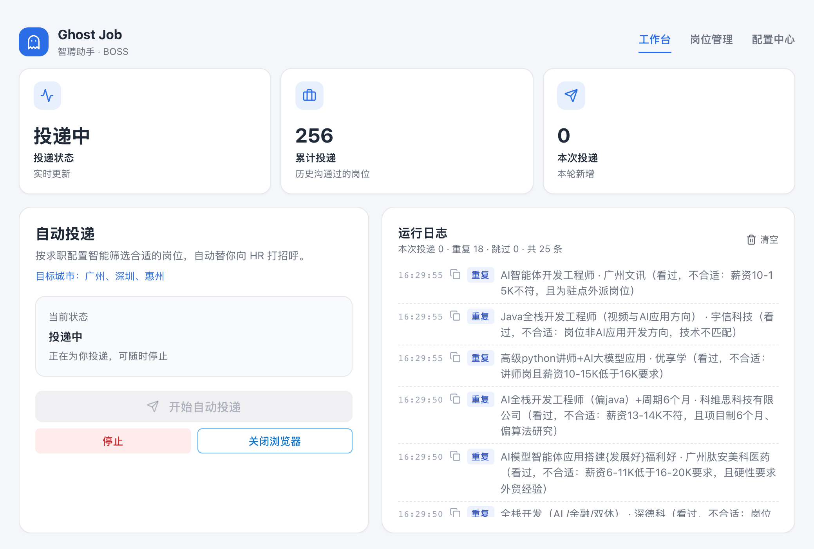
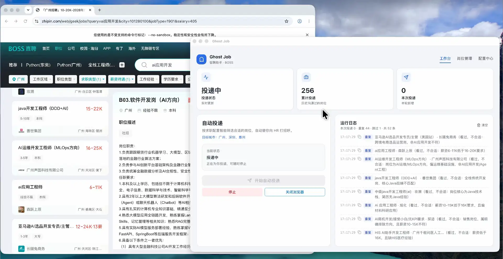
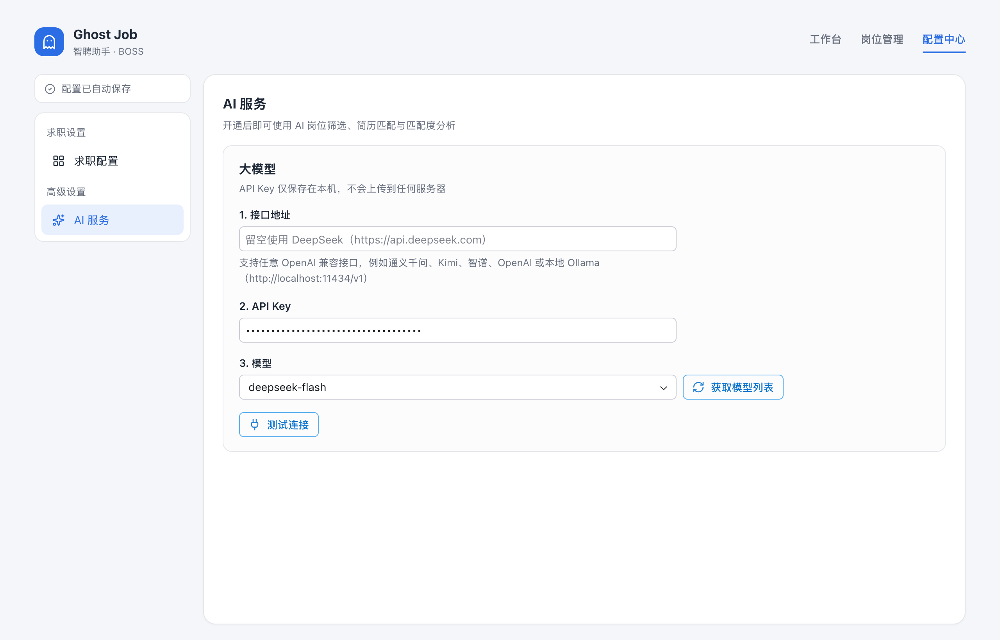
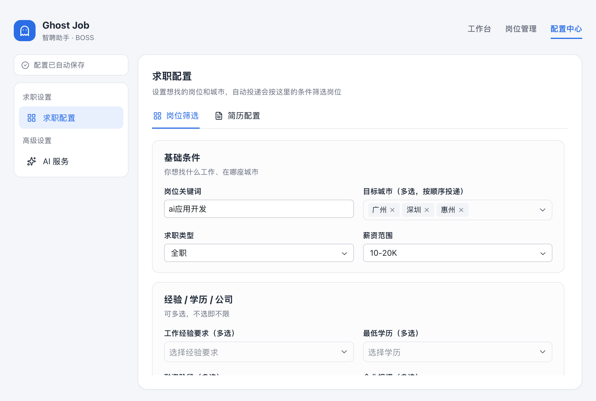
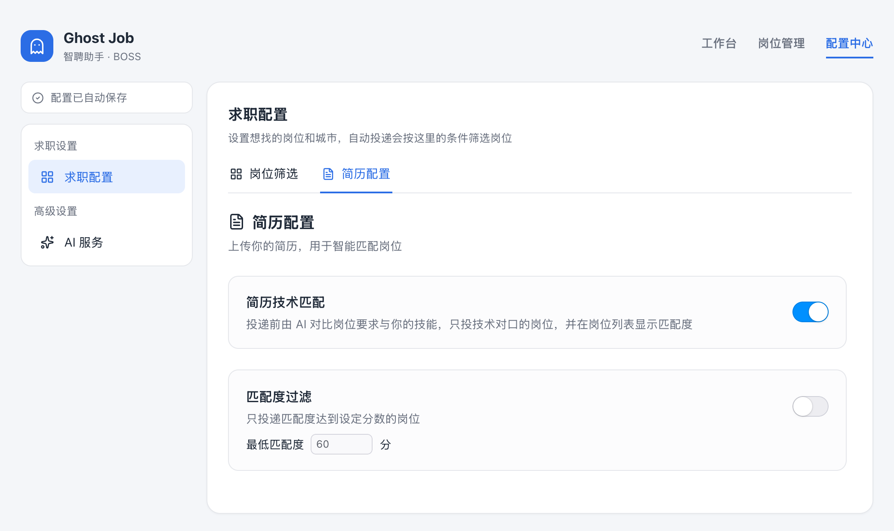
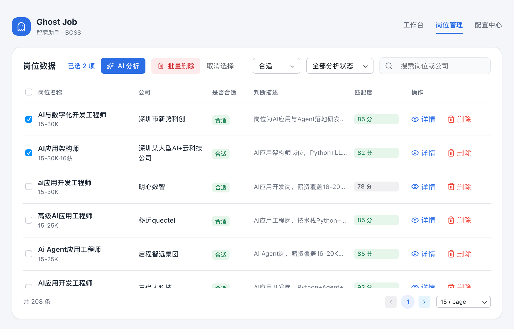
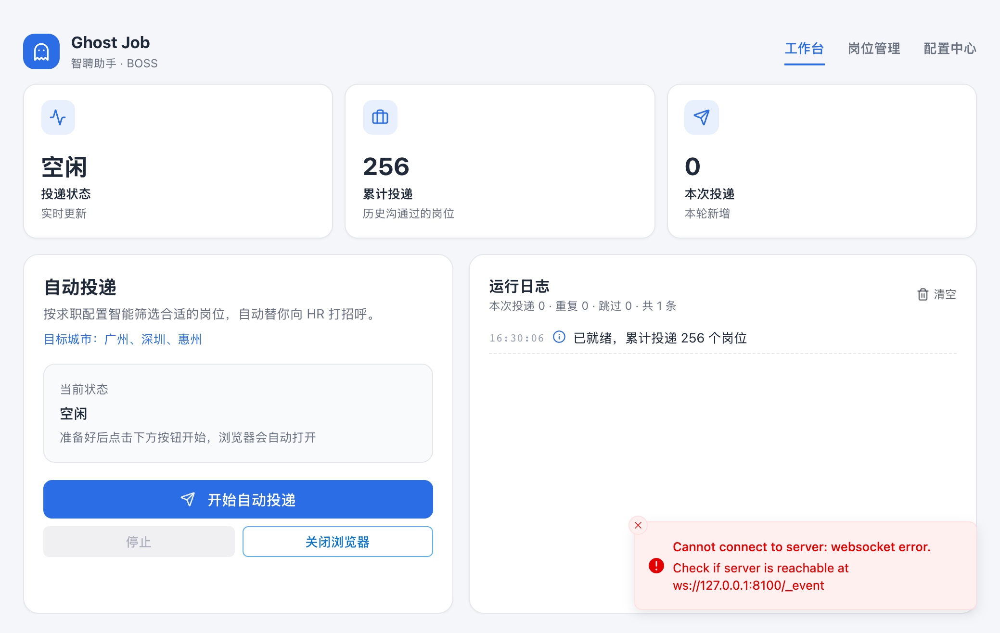

<div align="center">


# Ghost Job

**你的 BOSS 直聘智能投递助手**

按你的求职方向自动筛选岗位，AI 对比简历判断匹配度，只把简历投给真正合适的公司。

[下载安装](https://github.com/InfernalAzazel/ghost-job/releases) · [快速开始](#快速开始) · [常见问题](#常见问题) · [加入交流群](#加入交流群)

</div>



## 自动投递效果

左边是 BOSS 直聘，右边是 Ghost Job：投递时自动跳过看过的岗位并写明原因，在岗位管理里按「合适 / 不合适」查看判断结果，在配置中心随时调整求职方向和投递节奏。



更流畅的版本：[下载视频](assets/videos/auto-apply.mp4)

## 项目初衷

找工作本身已经足够辛苦。Ghost Job 希望把重复、机械的投递工作交给程序，让求职者把精力留给准备面试、提升自己，更快找到合适的工作。

本项目免费开源，仅供个人求职、学习与研究使用，**禁止任何形式的商业用途**，包括但不限于：

- 出售本软件或基于本软件修改的版本
- 以本软件为基础提供付费代投、代招聘等服务
- 将本软件集成进商业产品或用于公司、机构的营利性业务

请合理使用，遵守 BOSS 直聘的用户协议，不要用于批量骚扰 HR 或其他损害平台与他人利益的行为。

## 为什么用 Ghost Job

每天刷几百个岗位、逐个点开看职责、再挨个点「立即沟通」，这些重复劳动交给 Ghost Job 就好。

- **自动投递**：按你的求职条件逐个查看岗位，符合条件就替你向 HR 打招呼，全程无需守在电脑前
- **多城市轮换**：可以同时选多个城市，一个城市的岗位看完了，自动切换到下一个
- **AI 岗位筛选**：AI 阅读岗位职责，只投递符合你求职方向的岗位，销售、外包等一律避开
- **简历技术匹配**：上传简历后，AI 对比岗位技术要求与你的技能，给出 0 到 100 分的匹配度
- **匹配度过滤**：只投递匹配度达标的岗位，把每天有限的沟通次数花在刀刃上
- **像真人一样投递**：随机停顿、分批休息，每天节奏略有不同，降低账号风险
- **数据只在本机**：岗位记录、简历、API Key 全部保存在你自己的电脑上

## 快速开始

### 准备工作

1. 从 [Releases](https://github.com/InfernalAzazel/ghost-job/releases) 下载对应系统的安装包并安装
   - Windows：`.msi` 或 `.exe`
   - macOS：`.dmg`（Apple 芯片选 `aarch64`，Intel 选 `x64`）
   - Linux：`.AppImage` / `.deb` / `.rpm`

   > 目前已在 Windows 10 / 11 和 macOS 上测试可正常使用；**不支持 Windows 7**；Linux 版本尚未完整测试。
2. 安装 [Google Chrome](https://www.google.com/chrome/)（自动投递通过本机 Chrome 完成）
3. 准备一个大模型 API Key，推荐 [DeepSeek](https://platform.deepseek.com/api_keys)；也可以用通义千问、Kimi、智谱、OpenAI 等任意 OpenAI 兼容服务，或本地 Ollama

### 第一步：开通 AI 服务

打开 **配置中心 → AI 服务**：

1. 接口地址：使用 DeepSeek 时留空即可；使用其他服务时填写它的 OpenAI 兼容地址，例如本地 Ollama 填 `http://localhost:11434/v1`
2. 粘贴对应服务的 API Key（本地 Ollama 可随意填写）
3. 点击「获取模型列表」，选择一个模型
4. 点击「测试连接」，看到「连接成功」即可



### 第二步：设置求职条件

打开 **配置中心 → 求职配置 → 岗位筛选**，告诉 Ghost Job 你想找什么工作：

- **基础条件**：岗位关键词、目标城市（可多选）、求职类型、薪资范围
- **经验 / 学历 / 公司**：工作经验、学历、融资阶段、企业规模
- **行业与关键词**：只看感兴趣的行业；用「职位名排除」「屏蔽这些公司」避开不想要的岗位
- **AI 岗位筛选**（可选）：用一句话写清想投和不想投的方向，AI 帮你把关
- **投递节奏**：慢速 / 正常 / 快速，或自定义每条之间的停顿

所有修改自动保存。目标城市按选择的顺序依次投递，比如选了「广州、深圳」，会先投广州，广州的岗位看完再自动切到深圳。



#### AI 岗位筛选

在岗位筛选页下方打开「AI 岗位筛选」，在「求职方向」里写清想投什么、不想投什么。写得越具体，筛选越准。

下面是一份可以直接参考的模板，按自己的方向修改即可：

```text
只投 AI 应用开发、AI Agent 工程师、AI 应用工程师、AI 后端工程师 等岗位。

薪资要求：16K～20K/月，优先选择明确标注薪资范围符合要求的岗位。

岗位要求以 Python、FastAPI、LLM、Agent、RAG、模型 API、工具调用、工作流、AI 应用系统落地 为核心，偏工程开发与实际业务落地，而非理论研究。

优先考虑 AI 产品研发、智能体开发、AI 平台开发、AI 应用系统研发 等岗位。

明确排除：

* 产品经理、销售、运营、市场
* 纯算法研究、纯数据分析
* 传统 CRUD 开发
* 纯前端开发
* 与 AI 应用开发关联较弱的岗位
* 外包公司、项目外包、技术外包、人力外包
* 劳务派遣、第三方派遣、驻场开发、外派岗位
* 以项目制交付为主的岗位

核心目标：寻找 16K～20K、以 Python + LLM + Agent 为核心、偏 AI 应用工程落地的正式研发岗位。
```

### 第三步：上传简历

切到 **简历配置**：

1. 点击「上传简历」选择 PDF，内容会自动识别，也可以直接粘贴修改
2. 打开「简历技术匹配」，投递前 AI 会对比岗位要求与你的技能
3. 需要更严格时，打开「匹配度过滤」并设置最低分数（默认 60 分）



#### 简历技术匹配

打开「简历技术匹配」后，每个岗位投递前 AI 都会读一遍你的简历和岗位要求：

- 技术栈对不上的岗位直接跳过，运行日志里会写明原因
- 每个岗位会得到 0 到 100 分的匹配度，显示在「岗位管理」列表里
- 配合「匹配度过滤」，只投递达到最低分数的岗位，比如设为 60 分，低于 60 分的都不投

简历内容越完整，匹配越准。上传 PDF 后可以检查一下识别出来的文字，缺的技能、项目经历直接补上。

### 第四步：开始自动投递

回到 **工作台**，点击「开始自动投递」：

1. 首次使用会打开 Chrome，请在里面登录 BOSS 直聘，登录一次即可长期保持
2. Ghost Job 会按求职条件逐个查看岗位，符合条件的自动点击「立即沟通」；一个城市看完会自动切换到下一个城市
3. 运行日志实时显示每个岗位的处理结果；随时可以点击「停止」

所有城市的岗位都看完，或当天投递满 150 次，会自动停止，第二天可以继续。

### 第五步：查看与分析岗位

打开 **岗位管理** 查看所有看过的岗位，合适的和不合适的都会记录下来：

- 每个岗位都有「是否合适」和「判断描述」，比如「外包公司」「技术栈吻合」，鼠标移到描述上可查看完整内容
- 按「合适 / 不合适」（默认只看合适）和「已分析 / 未分析 / 高匹配」筛选，搜索岗位或公司
- 勾选岗位后点击「AI 分析」，按当前求职方向和简历重新判断是否合适，并更新匹配度
- 查看岗位详情，或批量删除不需要的记录



## 常见问题

**会重复投递同一个岗位吗？**
不会。看过的岗位都会记录下来，再次遇到同一个岗位（职位相同，或招聘标题、公司、HR 都相同）会直接跳过，不再重复调用 AI；之前已经沟通过的岗位也会跳过。运行日志会统计本次投递、重复和跳过的数量。

**从 v0.1.0 升级后打不开岗位管理或无法投递？**
v0.2.0 调整了本地数据结构。升级前请先退出 Ghost Job，删除用户目录下的 `.ghost-job/ghost-job.db`，再打开新版本，重新填写 API Key、求职配置并上传简历。Chrome 里的 BOSS 直聘登录状态不受影响。

**为什么有岗位被跳过了？**
运行日志会写明原因，例如不符合关键词、AI 判断方向不符、匹配度不足或此前已沟通。

**每天能投多少个？**
BOSS 直聘每天约 150 次沟通上限，Ghost Job 会在达到上限时自动停止。

**打开后右下角提示「Cannot connect to server」怎么办？**
这是正常现象，不用重装。Ghost Job 每次启动都要在后台加载 AI 和数据服务，加载完成前界面连不上，就会出现这个提示。一般等 1～3 分钟会自动消失，电脑配置越好越快。提示消失后就可以正常使用。



**支持哪些系统？**
已在 Windows 10 / 11 和 macOS 上测试可正常使用。不支持 Windows 7。Linux 提供了安装包，但尚未完整测试，遇到问题欢迎反馈。

**macOS 提示「无法验证开发者」怎么办？**
在应用上右键选择「打开」，或前往「系统设置 → 隐私与安全性」点击「仍要打开」。

**我的数据存在哪里？**
全部在本机 `~/.ghost-job/` 目录：岗位与配置在 `ghost-job.db`，简历在 `resumes/`，Chrome 登录状态在 `chrome-profile/`。

## 加入交流群

使用中遇到问题、有功能建议，或想和其他求职者交流经验，欢迎扫码添加作者微信，备注「Ghost Job」，拉你进交流群。


## 参与开发

基于 [Reflex](https://reflex.dev) + [reflex-desktop](https://github.com/FarhanAliRaza/reflex-desktop)（Tauri）构建，浏览器自动化使用 [Patchright](https://github.com/Kaliiiiiiiiii-Vinyzu/patchright)，AI 能力基于 [Pydantic AI](https://ai.pydantic.dev)。

```bash
uv sync
# 前置：Rust（rustup 稳定版）、Tauri CLI（cargo install tauri-cli --locked）
uv run reflex-desktop doctor --bundle
uv run python -m job        # 桌面窗口 + 热重载
uv run pytest -q            # 运行测试
```

推送 `v*` 标签后，GitHub Actions 会自动打包 Windows / macOS / Linux 安装包并发布到 Releases。

## 许可证

本项目采用 [PolyForm Noncommercial License 1.0.0](LICENSE) 许可证：个人使用、学习研究、公益与教育机构等非商业用途可以自由使用、修改和分发；**任何商业用途均不被允许**。如需商业授权，请通过 [Issues](https://github.com/InfernalAzazel/ghost-job/issues) 联系作者。

分发本软件或修改版本时，请保留 LICENSE 文件以及其中的 `Required Notice` 版权声明。
