<div align="center">

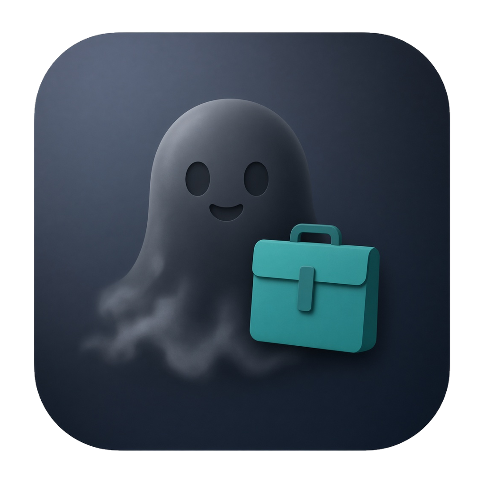

# Ghost Job

**你的 BOSS 直聘智能投递助手**

按你的求职方向自动筛选岗位，AI 对比简历判断匹配度，只把简历投给真正合适的公司。

[](https://github.com/InfernalAzazel/ghost-job/stargazers)
[](https://github.com/InfernalAzazel/ghost-job/releases/latest)
[](https://github.com/InfernalAzazel/ghost-job/releases)
[](LICENSE)

[下载安装](https://github.com/InfernalAzazel/ghost-job/releases) · [快速开始](#快速开始) · [常见问题](#常见问题) · [加入交流群](#加入交流群)

如果 Ghost Job 帮你省下了投递时间，欢迎点击右上角的 ⭐ **Star** 支持一下，让更多求职者看到它

</div>

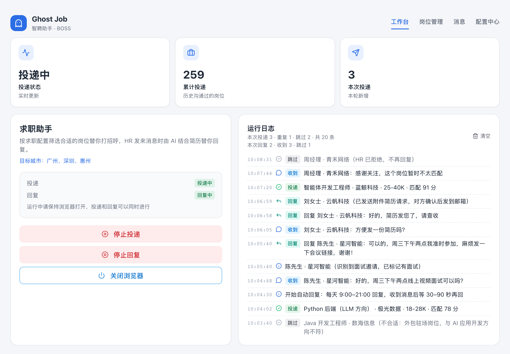

## 自动投递效果

左边是 BOSS 直聘，右边是 Ghost Job：投递时自动跳过看过的岗位并写明原因，在岗位管理里按「合适 / 不合适」查看判断结果，在配置中心随时调整求职方向和投递节奏。

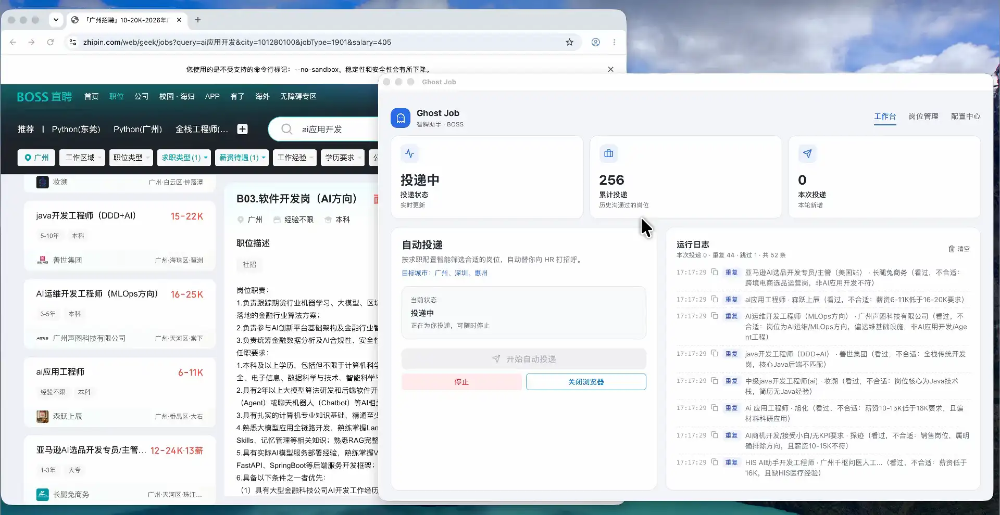

更流畅的版本：[下载视频](assets/videos/auto-apply.mp4)

## 项目初衷

找工作本身已经足够辛苦。Ghost Job 希望把重复、机械的投递工作交给程序，让求职者把精力留给准备面试、提升自己，更快找到合适的工作。

本项目免费开源，仅供个人求职、学习与研究使用，**禁止任何形式的商业用途**，包括但不限于：

- 出售本软件或基于本软件修改的版本
- 以本软件为基础提供付费代投、代招聘等服务
- 将本软件集成进商业产品或用于公司、机构的营利性业务

请合理使用，遵守 BOSS 直聘的用户协议，不要用于批量骚扰 HR 或其他损害平台与他人利益的行为。

## 为什么用 Ghost Job

每天刷几百个岗位、逐个点开看职责、再挨个点「立即沟通」，这些重复劳动交给 Ghost Job 就好。

- **自动投递**：按你的求职条件逐个查看岗位，符合条件就替你向 HR 打招呼，全程无需守在电脑前
- **多城市轮换**：可以同时选多个城市，一个城市的岗位看完了，自动切换到下一个
- **AI 岗位筛选**：AI 阅读岗位职责，只投递符合你求职方向的岗位，销售、外包等一律避开
- **简历技术匹配**：上传简历后，AI 对比岗位技术要求与你的技能，给出 0 到 100 分的匹配度
- **匹配度过滤**：只投递匹配度达标的岗位，把每天有限的沟通次数花在刀刃上
- **像真人一样投递**：随机停顿、分批休息，每天节奏略有不同，降低账号风险
- **AI 自动回复**：HR 发来消息时，AI 结合你的简历和岗位信息回复，HR 索要简历时自动发送附件简历，只在白天的回复时段工作；HR 主动找你的新岗位也会按求职条件判断并记录
- **消息记录**：和 HR 的聊天按会话集中查看，哪些是 AI 自动回复的一目了然；刚投递的会话自动记录，几千个会话也能流畅切换
- **同步历史会话**：一键把 BOSS 上以前聊过的会话和聊天记录同步进来，对应岗位一并记录，方便集中复盘
- **沟通状态**：AI 识别到面试邀请会自动标记「有面试」，HR 拒绝、AI 婉拒也会自动标记；面试后可以手动标记「已面试」「面试通过」「面试不通过」，并按状态筛选会话
- **多种大模型可选**：默认使用 DeepSeek，也可以接入通义千问、Kimi、智谱、OpenAI 或本地 Ollama
- **查企业**：一键读取公司的工商信息，上网搜索欠薪、裁员、失信等负面信息，AI 给出低 / 中 / 高风险评估和依据，风险标签直接显示在岗位和会话列表里，完整结果可下载为 PDF 报告
- **数据导出**：岗位和聊天记录都能一键导出为 JSON，方便整理、复盘或交给其他工具处理
- **数据只在本机**：岗位记录、简历、API Key 全部保存在你自己的电脑上
- **新版本提醒**：顶部显示当前版本号，有新版本时旁边出现提示，点击直接打开下载页

## 快速开始

### 准备工作

1. 从 [Releases](https://github.com/InfernalAzazel/ghost-job/releases) 下载对应系统的安装包并安装
   - Windows：`.msi` 或 `.exe`
   - macOS：`.dmg`（Apple 芯片选 `aarch64`，Intel 选 `x64`）
   - Linux：`.AppImage` / `.deb` / `.rpm`

   > 目前已在 Windows 10 / 11 和 macOS 上测试可正常使用；**不支持 Windows 7**；Linux 版本尚未完整测试。
2. 安装 [Google Chrome](https://www.google.com/chrome/)（自动投递通过本机 Chrome 完成）
3. 准备一个大模型 API Key，推荐 [DeepSeek](https://platform.deepseek.com/api_keys)；也可以用通义千问、Kimi、智谱、OpenAI 等任意 OpenAI 兼容服务，或本地 Ollama

### 第一步：开通 AI 服务

打开 **配置中心 → AI 服务**：

1. 接口地址：使用 DeepSeek 时留空即可；使用其他服务时填写它的 OpenAI 兼容地址，例如本地 Ollama 填 `http://localhost:11434/v1`
2. 粘贴对应服务的 API Key（本地 Ollama 可随意填写）
3. 点击「获取模型列表」，选择一个模型
4. 点击「测试连接」，看到「连接成功」即可

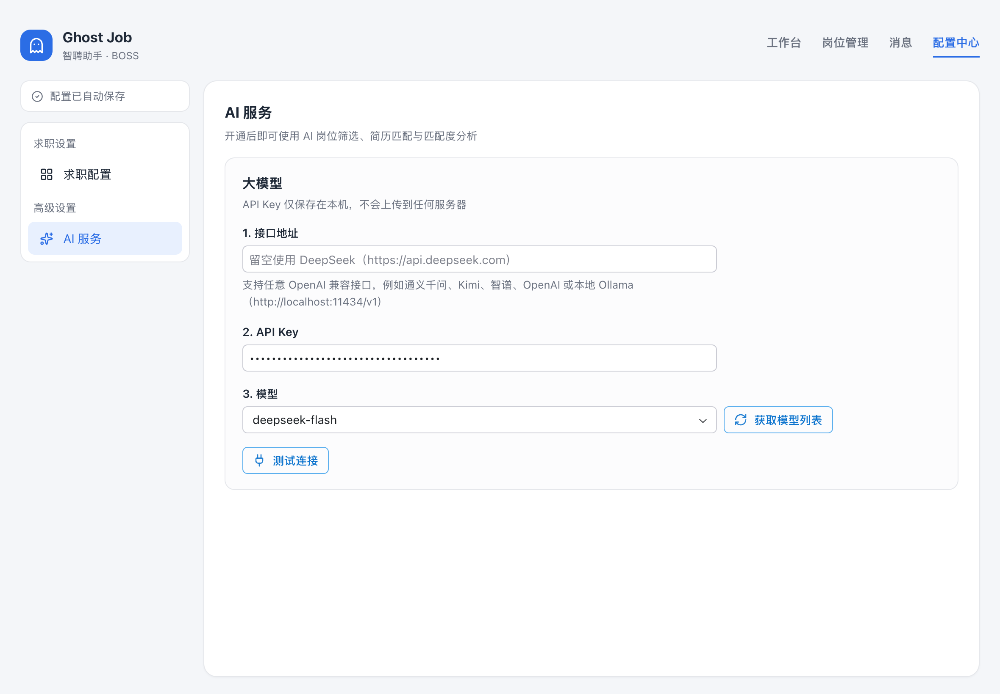

### 第二步：设置求职条件

打开 **配置中心 → 求职配置 → 岗位筛选**，告诉 Ghost Job 你想找什么工作：

- **基础条件**：岗位关键词、目标城市（可多选）、求职类型、薪资范围
- **经验 / 学历 / 公司**：工作经验、学历、融资阶段、企业规模
- **行业与关键词**：只看感兴趣的行业；用「职位名排除」「屏蔽这些公司」避开不想要的岗位
- **AI 岗位筛选**（可选）：用一句话写清想投和不想投的方向，AI 帮你把关
- **投递节奏**：慢速 / 正常 / 快速，或自定义每条之间的停顿

所有修改自动保存。目标城市按选择的顺序依次投递，比如选了「广州、深圳」，会先投广州，广州的岗位看完再自动切到深圳。

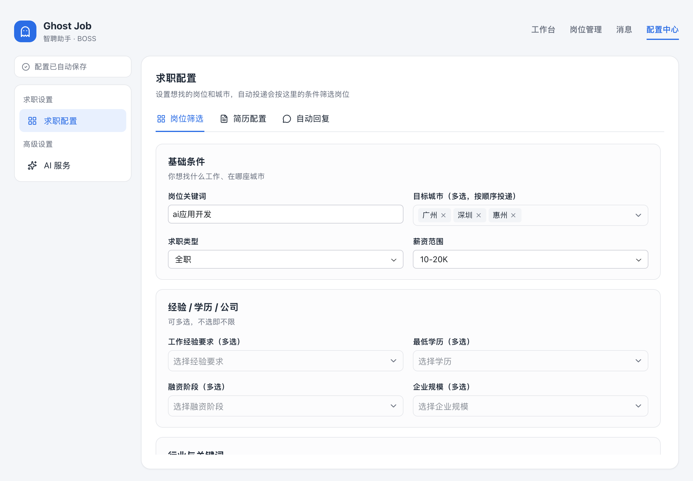

#### AI 岗位筛选

在岗位筛选页下方打开「AI 岗位筛选」，在「求职方向」里写清想投什么、不想投什么。写得越具体，筛选越准。

下面是一份可以直接参考的模板，按自己的方向修改即可：

```text
只投 AI 应用开发、AI Agent 工程师、AI 应用工程师、AI 后端工程师 等岗位。

薪资要求：16K～20K/月，优先选择明确标注薪资范围符合要求的岗位。

岗位要求以 Python、FastAPI、LLM、Agent、RAG、模型 API、工具调用、工作流、AI 应用系统落地 为核心，偏工程开发与实际业务落地，而非理论研究。

优先考虑 AI 产品研发、智能体开发、AI 平台开发、AI 应用系统研发 等岗位。

明确排除：

* 产品经理、销售、运营、市场
* 纯算法研究、纯数据分析
* 传统 CRUD 开发
* 纯前端开发
* 与 AI 应用开发关联较弱的岗位
* 外包公司、项目外包、技术外包、人力外包
* 劳务派遣、第三方派遣、驻场开发、外派岗位
* 以项目制交付为主的岗位

核心目标：寻找 16K～20K、以 Python + LLM + Agent 为核心、偏 AI 应用工程落地的正式研发岗位。
```

### 第三步：上传简历

切到 **简历配置**：

1. 点击「上传简历」选择 PDF，内容会自动识别，也可以直接粘贴修改
2. 打开「简历技术匹配」，投递前 AI 会对比岗位要求与你的技能
3. 需要更严格时，打开「匹配度过滤」并设置最低分数（默认 60 分）

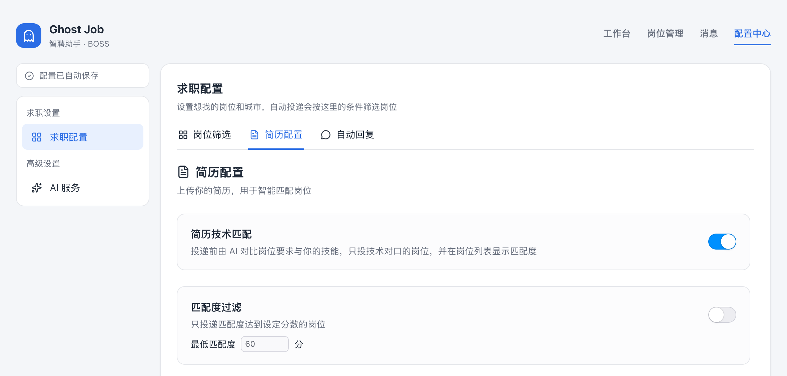

#### 简历技术匹配

打开「简历技术匹配」后，每个岗位投递前 AI 都会读一遍你的简历和岗位要求：

- 技术栈对不上的岗位直接跳过，运行日志里会写明原因
- 每个岗位会得到 0 到 100 分的匹配度，显示在「岗位管理」列表里
- 配合「匹配度过滤」，只投递达到最低分数的岗位，比如设为 60 分，低于 60 分的都不投

简历内容越完整，匹配越准。上传 PDF 后可以检查一下识别出来的文字，缺的技能、项目经历直接补上。

### 第四步：开始自动投递

回到 **工作台**，点击「开始自动投递」：

1. 首次使用会打开 Chrome，请在里面登录 BOSS 直聘，登录一次即可长期保持
2. Ghost Job 会按求职条件逐个查看岗位，符合条件的自动点击「立即沟通」；一个城市看完会自动切换到下一个城市
3. 运行日志实时显示每个岗位的处理结果；投递开始后按钮会变成「停止投递」，随时可以点击结束

所有城市的岗位都看完，或当天投递满 150 次，会自动停止，第二天可以继续。

### 第五步：查看与分析岗位

打开 **岗位管理** 查看所有看过的岗位，合适的和不合适的都会记录下来：

- 每个岗位都有「是否合适」和「判断描述」，比如「外包公司」「技术栈吻合」，鼠标移到描述上可查看完整内容
- 按「合适 / 不合适」（默认只看合适）和「已分析 / 未分析 / 高匹配」筛选，搜索岗位或公司
- 勾选岗位后点击「AI 分析」，按当前求职方向和简历重新判断是否合适，并更新匹配度
- 查看岗位详情，或批量删除不需要的记录
- 点击操作列的「查企业」，读取 BOSS 公司主页的工商信息（企业全称、法人、注册资本、成立时间、经营状态等），用公司全称上网搜索欠薪、裁员、失信被执行等负面信息，再由 AI 综合评估为低风险、中风险、高风险或信息不足，并列出依据和来源链接。结果按公司保存，公司名旁显示风险标签，下次打开直接查看，点「重新查询」可刷新。没有配置 AI 服务时只展示工商信息和搜索结果
- 点击「导出全部」把所有岗位导出为 JSON；勾选岗位后点击「导出」，只导出勾选的岗位。导出包含全部字段（岗位信息、HR、是否合适、判断描述、匹配度、是否已投递、入库时间等）

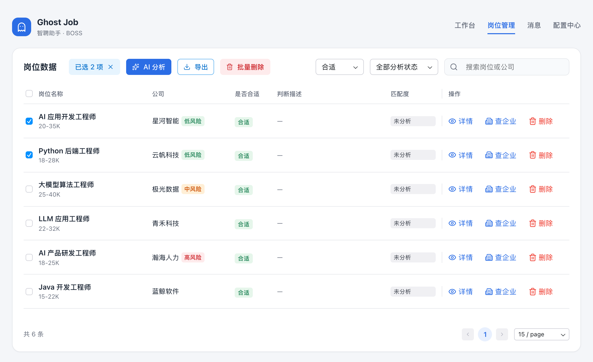

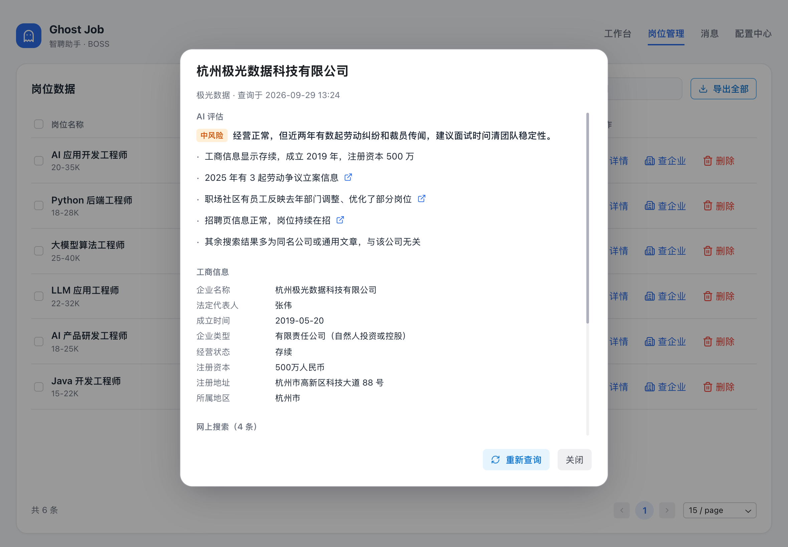

点「下载报告」后选择保存位置，得到一份 PDF 企业报告：AI 风险评估和依据、工商信息、网上搜索到的全部资料，来源链接可以直接点击打开，方便存档或分享。

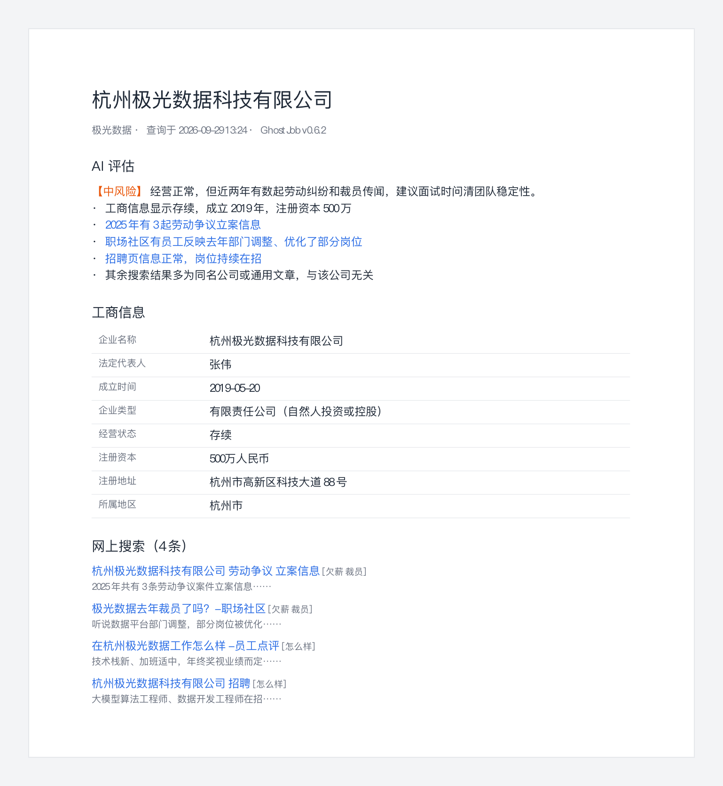

### 第六步：自动回复 HR 消息

1. 打开 **配置中心 → 求职配置 → 自动回复**，开启「启用自动回复」（需要先开通 AI 服务并上传简历；想让 HR 要简历时自动发送，还要在 BOSS 直聘上传附件简历）
2. 按需修改「回复提示词」，比如语气、薪资怎么回答、到岗时间（可参考下方的模板）
3. 在最下方的「回复节奏」选择慢速 / 正常 / 快速，或自定义回复时段、每条回复前的等待时间和休息间隔；不在回复时段收到的消息，会顺延到下一个时段再回
4. 回到 **工作台**，点击「开始自动投递」下方的「开始自动回复」，可以和自动投递同时运行；需要结束时点击「停止回复」

#### 回复提示词模板

AI 回复时会参考你的简历、沟通的岗位、岗位是否合适的判断和最近的聊天记录，提示词只需要写清楚「怎么回」。下面是一份可以直接参考的模板，按自己的情况修改即可：

```text
你是正在求职的我，在 BOSS 直聘上和 HR 沟通。请根据我的简历回复 HR 的最新消息。
一切以我的利益为最高原则：不为了迎合 HR 让步，不轻易答应对我不利的条件。

基本要求：
* 语气礼貌、真诚、口语化，像真人聊天，每次回复不超过 80 字
* 只根据简历里的真实经历回答，不编造经历、技能、证书和学历
* 不重复打招呼，不用表情符号，不说「作为 AI」之类的话

常见问题怎么回：
* 索要简历：简短回应即可，如「好的，简历发您了，请查收」，程序会自动发送附件简历
* 问薪资：期望 16K～20K/月，可根据岗位职责和整体待遇再沟通
* 问到岗时间：离职后一周内可到岗
* 问简历里没有的技能或经历：如实说明没有相关经验，可以补充相近的经历
* 问学历、证书等硬性条件：如实回答，不回避

面试方式（第一轮优先线上）：
* 问能否面试：表示可以，希望第一轮先线上面试（视频或电话），请对方告知时间
* 约线下面试（如「什么时候方便过来面试」）：先礼貌询问第一轮能否改为线上，给一个合理的理由，
  并表示第二轮可以到公司面谈。理由要符合简历里的真实情况：简历显示仍在职，可以说「目前还在职，
  白天不方便请假」；已离职，可以说「近期面试安排比较密集」；距离较远，可以说「往返需要半天」
* 第二轮及之后的面试：可以接受线下，请对方告知时间和地址
* HR 坚持第一轮必须线下：礼貌婉拒，感谢对方，表示如果之后可以线上沟通再联系

岗位不合适时：
* 岗位判断为不合适，或是外包、驻场、派遣、与 AI 应用开发无关的岗位，礼貌说明方向不一致并感谢对方，不再追问细节
* HR 明确表示不合适或岗位已招满时，不用回复
```

「面试方式」这一段让第一轮先线上面试，避免 HR 只是为了完成邀约 KPI 让你白跑一趟，确认对方有诚意后第二轮再去线下；不需要的话删掉即可。「岗位不合适时」这一段和「HR 坚持第一轮必须线下」决定 AI 什么时候替你婉拒，婉拒后会话会被标记，见下文。

HR 发来的消息和 AI 的回复都会显示在运行日志里。如果是 HR 主动找你、之前没看过的岗位，会先按求职条件和 AI 岗位筛选判断，再记录到岗位管理。

**自动发送简历**：HR 索要简历时（如「方便发份简历吗」），AI 先回复一句，再自动点击聊天窗口里的「发简历」并确认，发送你在 BOSS 直聘上传的附件简历。聊天里出现「附件简历请求已发送」即为发出，HR 确认后简历会发到对方邮箱，运行日志会显示「已发送附件简历请求」。双方还没互动、按钮不可用，或者还没上传附件简历时，运行日志会提示你手动发送。

**沟通状态**：每个会话有一个沟通状态，AI 回复时会自动更新：

- HR 明确表示不合适（如「暂不匹配」「岗位已招满」）时不会再回复，标记为「HR 已拒绝」；岗位不合适、AI 已替你婉拒的标记为「AI 已婉拒」。之后 HR 再发来新消息，AI 会重新判断要不要继续沟通，继续沟通时会清掉这个标记
- HR 发出面试邀请，或者正在和你约面试时间、地点、方式时，标记为「有面试」，运行日志会显示「识别到面试邀请，已标记有面试」；只是介绍面试流程（如「我们是线下面试」）不算
- 面试之后可以手动标记「已面试」「面试通过」或「面试不通过」，这三种状态 AI 不会改动；「面试不通过」和「HR 已拒绝」「AI 已婉拒」一样，HR 没有新消息时不再回复

打开 **消息** 可以查看和每位 HR 的聊天记录：

- 自动回复运行时，新出现的会话（比如刚投递、BOSS 替你发了打招呼的）会自动记录进来，不用等 HR 回复
- 左侧是会话列表，支持按 HR、公司或岗位搜索，点搜索框里的 × 清空；每个会话显示沟通状态标签，有面试、面试通过为绿色，面试不通过、HR 已拒绝为红色，已面试为蓝色，AI 已婉拒为灰色。列表先显示最近的会话，往下滚动自动加载更多
- 点击搜索框旁的筛选按钮，可以只看某一种沟通状态，选「无状态」查看还没有任何状态的会话，或者选「所有面试」查看有面试、已面试、面试通过、面试不通过的会话
- 右侧是聊天内容和沟通的职位，AI 自动回复的消息会单独标注；右上角的「沟通状态」下拉可以手动修改当前会话的状态，选「无」即清除
- 会话顶部点击「查企业」，查看这家公司的工商信息、网上负面信息和 AI 风险评估，与岗位管理里的查企业共用结果；查过的公司在会话列表里显示风险标签
- 列表底部点击「导出全部」，把所有会话导出为 JSON，每个会话包含 HR、公司、岗位、沟通状态和完整的聊天记录；勾选会话后点击「导出」，只导出勾选的会话

**同步历史会话**：点击搜索框旁的同步按钮，把 BOSS 上以前聊过、还没记录下来的会话和聊天记录同步进来：

- 对应的岗位也会记录到岗位管理：新岗位只按岗位筛选里的关键词判断，其余标为「合适 · 待 AI 分析」，需要时在岗位管理里勾选做 AI 分析
- 同步只读取、不回复，每个会话之间会停顿几秒；会话多时要一段时间，可以随时停止，下次点同步会从剩下的继续

> [!WARNING]
> 同步会连续读取大量会话，建议先在工作台停止自动投递和自动回复再同步，避免同一时间访问 BOSS 过于频繁，降低账号被风控的风险。自动投递或自动回复运行时无法开始同步，同步时也无法开始投递或开启自动回复。

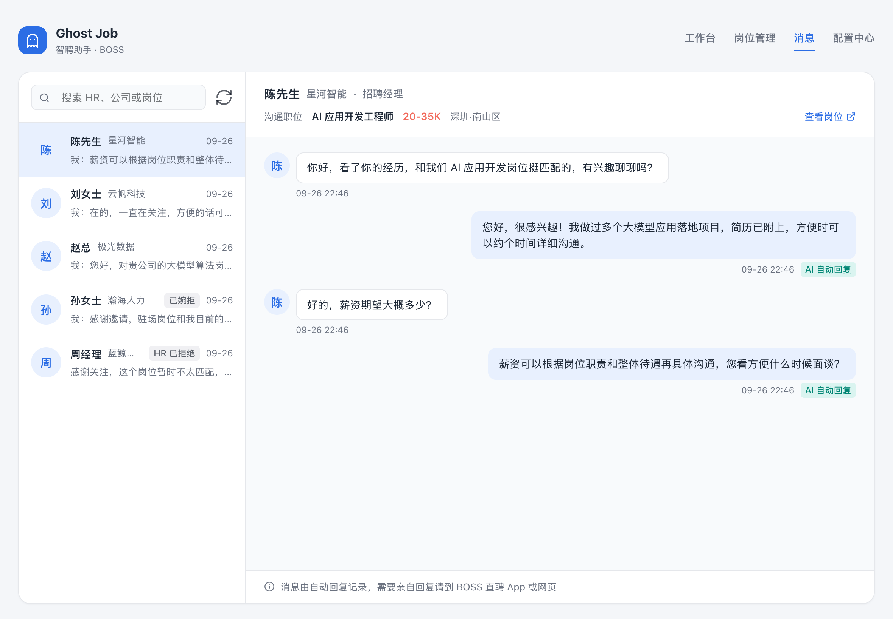

## 常见问题

**会重复投递同一个岗位吗？**
不会。看过的岗位都会记录下来，再次遇到同一个岗位（职位相同，或招聘标题、公司、HR 都相同）会直接跳过，不再重复调用 AI；之前已经沟通过的岗位也会跳过。运行日志会统计本次投递、重复和跳过的数量。

**从 v0.5.x 升级后打不开岗位管理或无法投递？**
v0.6.0 为查企业调整了本地数据结构，v0.6.1 首次启动时会自动补齐，原有数据全部保留。v0.6.2 起不再包含这个自动补齐：从 v0.5.x 升级请先安装 [v0.6.1](https://github.com/InfernalAzazel/ghost-job/releases/tag/v0.6.1) 打开一次，再升级到最新版；已经用过 v0.6.1 的直接升级即可。

**从 v0.1.0 升级后打不开岗位管理或无法投递？**
v0.2.0 调整了本地数据结构。升级前请先退出 Ghost Job，删除用户目录下的 `.ghost-job/ghost-job.db`，再打开新版本，重新填写 API Key、求职配置并上传简历。Chrome 里的 BOSS 直聘登录状态不受影响。

**为什么有岗位被跳过了？**
运行日志会写明原因，例如不符合关键词、AI 判断方向不符、匹配度不足或此前已沟通。

**自动回复发的是哪份简历？**
发的是你在 BOSS 直聘上传的附件简历，不是配置中心里上传的简历（那份只给 AI 参考回复用）。

**除了 DeepSeek 还能用哪些大模型？**
任何兼容 OpenAI 接口的服务都可以，例如通义千问、Kimi、智谱、OpenAI。在 **配置中心 → AI 服务** 的「接口地址」填写该服务的地址，再填 API Key、获取模型列表即可；用本地 Ollama 时填 `http://localhost:11434/v1`，API Key 随意填写。接口地址留空就是 DeepSeek。

**每天能投多少个？**
BOSS 直聘每天约 150 次沟通上限，Ghost Job 会在达到上限时自动停止。

**打开后显示「Ghost Job 正在启动，请稍候…」怎么办？**
这是正常现象，不用重装。Ghost Job 每次启动都要在后台加载 AI 和数据服务，加载完成前会先显示这个启动页，加载完后自动进入工作台，一般几秒到 1 分钟，电脑配置越好越快。旧版本在这时会在右下角提示「Cannot connect to server」，同样等一会儿就会消失。如果等了 3 分钟以上还没进入，请关闭程序重新打开；仍然不行的话，请带上日志提 Issue。

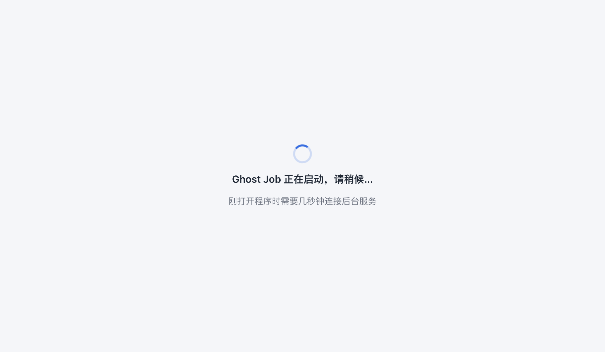

**支持哪些系统？**
已在 Windows 10 / 11 和 macOS 上测试可正常使用。不支持 Windows 7。Linux 提供了安装包，但尚未完整测试，遇到问题欢迎反馈。

**Windows 打开时提示缺少 `python312.dll` 怎么办？**
先升级到最新版本。v0.4.5 及更早的部分版本打包时，有时会把 `python312.dll` 放错位置，从 v0.4.6 起打包时会自动检查，不会再出现。临时解决办法：把安装目录下 `python\python\` 里的 `python312.dll`、`python3.dll`、`vcruntime140.dll`、`vcruntime140_1.dll` 复制到 `ghost-job.exe` 所在的目录。

升级后仍然报错，就可能是电脑里的 Python 环境冲突。常见情况是之前用 Python 官网安装包装过其他版本的 Python（例如 3.13），系统环境变量里的 Python 路径干扰了 Ghost Job 自带的运行环境。如果你平时需要使用 Python，建议改用 [uv](https://docs.astral.sh/uv/) 管理 Python，让各个 Python 版本互相隔离：

1. 在「设置 → 应用」里卸载用官网安装包装的 Python，并检查「系统属性 → 环境变量」，删除 `Path` 里残留的 Python 路径，以及 `PYTHONHOME`、`PYTHONPATH` 变量（如果有）
2. 打开 PowerShell，安装 uv：

   ```powershell
   powershell -ExecutionPolicy ByPass -c "irm https://astral.sh/uv/install.ps1 | iex"
   ```

   国内网络下载慢的话，也可以到 [GitHub Releases](https://github.com/astral-sh/uv/releases) 下载 `uv-x86_64-pc-windows-msvc.zip`，解压后把 `uv.exe` 所在目录加入 `Path`
3. 关闭并重新打开 PowerShell，运行 `uv --version`，能看到版本号就说明安装成功
4. 以后需要 Python 时用 uv 安装，例如 `uv python install 3.13`，它不会修改系统环境变量，也就不会再影响 Ghost Job
5. 重新打开 Ghost Job 即可正常使用

更多安装方式见 [uv 官方安装文档](https://docs.astral.sh/uv/getting-started/installation/)。

**macOS 提示「无法验证开发者」怎么办？**
在应用上右键选择「打开」，或前往「系统设置 → 隐私与安全性」点击「仍要打开」。

**我的数据存在哪里？**
全部在本机 `~/.ghost-job/` 目录：岗位与配置在 `ghost-job.db`，简历在 `resumes/`，Chrome 登录状态在 `chrome-profile/`。

## 加入交流群

使用中遇到问题、有功能建议，或想和其他求职者交流经验，欢迎扫码添加作者微信，备注「Ghost Job」，拉你进交流群。


## 参与开发

基于 [Reflex](https://reflex.dev) + [reflex-desktop](https://github.com/FarhanAliRaza/reflex-desktop)（Tauri）构建，浏览器自动化使用 [Patchright](https://github.com/Kaliiiiiiiiii-Vinyzu/patchright)，AI 能力基于 [Pydantic AI](https://ai.pydantic.dev)。

```bash
uv sync
# 前置：Rust（rustup 稳定版）、Tauri CLI（cargo install tauri-cli --locked）
uv run reflex-desktop doctor --bundle
uv run python -m job        # 桌面窗口 + 热重载
uv run pytest -q            # 运行测试
```

版本号只写在 `job/__init__.py` 的 `__version__`，`pyproject.toml` 从这里读取。推送 `v*` 标签后，GitHub Actions 会自动打包 Windows / macOS / Linux 安装包并发布到 Releases。

### 提交 PR 的规则

请**先开 Issue，再提交 PR**，避免多人重复修同一个问题，或者改完才发现方向不对：

1. **先开 Issue**：到 [Issues](https://github.com/InfernalAzazel/ghost-job/issues) 描述你遇到的问题，尽量包含：
   - 做了什么操作，期望的结果和实际的结果
   - 运行日志或终端里的报错信息（截图或复制文字都可以，注意去掉手机号、简历等个人信息）
   - 使用的版本号和操作系统（如 v0.4.2 / macOS 15）
   - 功能建议请说明使用场景，以及你打算怎么实现
2. **确认后再动手**：等作者回复确认是问题、或同意这个功能方向后再开始修改
3. **提交 PR**：
   - 在 PR 描述里写上 `Closes #Issue 编号`，并说明改了什么、怎么验证的
   - 一个 PR 只做一件事，不要夹带无关的格式化或重构
   - 提交前运行 `uv run pytest -q` 确保测试通过；修复问题或新增功能请补上对应的测试
   - 涉及界面的改动，请附上修改前后的截图

错别字、文档链接失效这类很小的修改，可以直接提交 PR，不用先开 Issue。

## Star 趋势

每一个 Star 都是继续更新的动力。如果 Ghost Job 帮你拿到了面试，欢迎点个 ⭐ Star，或者推荐给身边正在找工作的朋友。

<a href="https://star-history.com/#InfernalAzazel/ghost-job&Date">
  <picture>
    <source media="(prefers-color-scheme: dark)" srcset="https://api.star-history.com/svg?repos=infernalazazel/ghost-job&type=Date&theme=dark" />
    <source media="(prefers-color-scheme: light)" srcset="https://api.star-history.com/svg?repos=infernalazazel/ghost-job&type=Date" />
    
  </picture>
</a>

## 许可证

本项目采用 [PolyForm Noncommercial License 1.0.0](LICENSE) 许可证：个人使用、学习研究、公益与教育机构等非商业用途可以自由使用、修改和分发；**任何商业用途均不被允许**。如需商业授权，请通过 [Issues](https://github.com/InfernalAzazel/ghost-job/issues) 联系作者。

分发本软件或修改版本时，请保留 LICENSE 文件以及其中的 `Required Notice` 版权声明。
